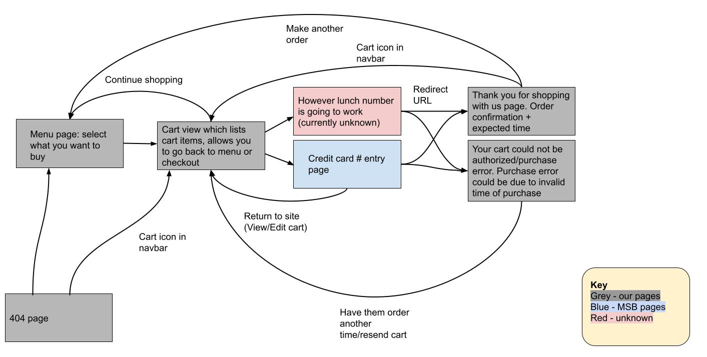
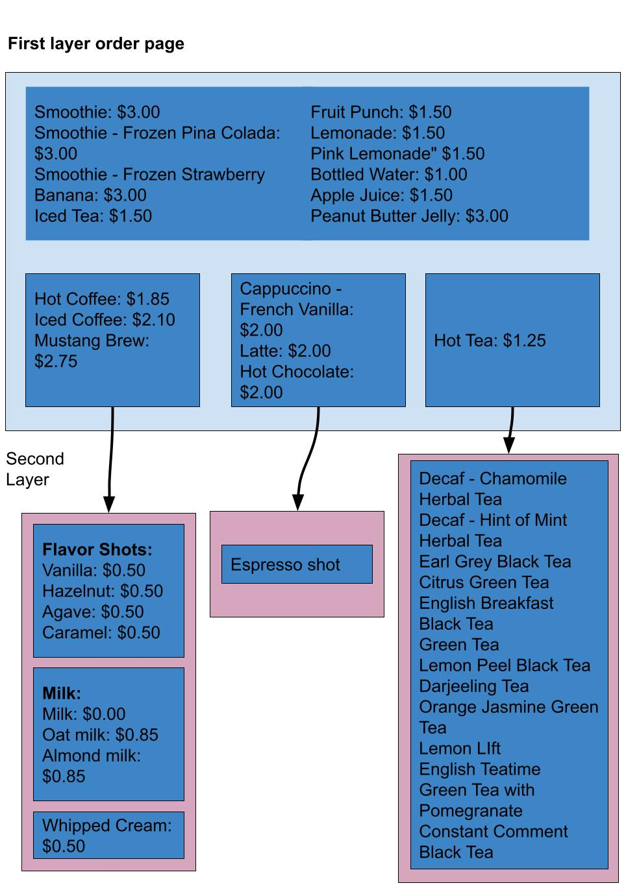
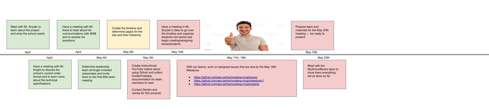

# mustang-mug

The website, backend, and dashboard for the Mustang Mug Cafe. This readme serves chiefly as a contribution guide for GMHS students. If you have a question about a specific issue, please reach out to the individual who created the issue.

[Site available here!](https://mustang-mug.web.app/)

## Table of Contents

-   [mustang-mug](#mustang-mug)
    -   [Table of Contents](#table-of-contents)
    -   [Contribution Guides](#contribution-guides)
    -   [Setup](#setup)
        -   [Install homebrew](#install-homebrew)
        -   [Install Node](#install-node)
        -   [Install Firebase Tools](#install-firebase-tools)
        -   [Configure the repository](#configure-the-repository)
        -   [Test your code](#test-your-code)
    -   [Selected Documentation](#selected-documentation)
        -   [Design](#design)
        -   [Development](#development)
    -   [Selected Administration-Sourced Information for Website](#selected-administration-sourced-information-for-website)
        -   [Technical Specifications](#technical-specifications)
        -   [Current Mustang-Mug Order Procedure](#current-mustang-mug-order-procedure)
        -   [Benefits of an API and Order Site over a Google Form](#benefits-of-an-api-and-order-site-over-a-google-form)
    -   [Project Timeline](#project-timeline)

## Contribution Guides

If you'd like to begin contributing, there are two different pathways to help out, one being design and the other development. Before you begin with either, please read their corresponding guides.

-   [Design Group](https://docs.google.com/document/d/1Li7CFu5svkT2dZMmUMs8T7QXtFuoNox9WiU2pSIEUkg/edit)
-   [Development Group](https://docs.google.com/document/d/11pG9MPToPxX9a-AQYE3q3QMyvRmRDZvPR6uQrVQUTao/edit)

After reading through your selected guide, please refer to the "Find Work to do" subsection within both of them to begin contributing.

## Setup

### Install homebrew

    cd && mkdir homebrew && curl -L https://github.com/Homebrew/brew/tarball/master | tar xz --strip 1 -C homebrew

### Install Node

    brew install node

### Install Firebase Tools

    mkdir ~/.npm-global
    npm config set prefix '~/.npm-global'

After changing your npm prefix, you need to activate it in your bash profile. Open the profile:

    vi ~/.bash_profile

Add the following lines to the file:

    export PATH=~/.npm-global/bin:$PATH

Then reactivate your bash profile:

    . ~/.bash_profile

Now, you can install the firebase tools:

    npm install -g firebase-tools

After installation, login to firebase (make sure to use your school google account):

    firebase login

### Configure the repository

In terminal, inside your repository's folder, install dependencies:

    npm install && npm install --prefix functions

Build the necessary hosting files for future runs:

    npm run build

Set the firebase project

    firebase use --add

### Test your code

Create a file called `.env.development.local` in your project's root directory. Add these lines:

    GOOGLE_APPLICATION_CREDENTIALS="./src/admin/mustang-mug-firebase-adminsdk-te6ci-2af91d14d1.json"
    FIRESTORE_EMULATOR_HOST="localhost:8080"
    FIREBASE_AUTH_EMULATOR_HOST="localhost:9099"

Then, add your service account JSON file to the `admin` directory inside `src`. You can get this file by contacting [@AndrewLester](https://github.com/AndrewLester). The file should be named `mustang-mug-firebase-adminsdk-te6ci-2af91d14d1.json`. Also ask for the MySchoolBucks API key at the same time, which you'll need to test API interactions. Now, you are ready to test. Run the firebase emulators:

    firebase emulators:start

In a separate shell tab, start the dev server.

    npm run dev

If you want to do a full test with the Firebase emulators, make sure to get the Firebase function config locally (run this in the functions folder):
firebase functions:config:get > .runtimeconfig.json

## Selected Documentation

### Design

-   [Figma Lessons and Design Exercises](https://www.figma.com/resources/learn-design/)

### Development

-   MySchoolBucks API
    -   [MSB Overview](https://www.myschoolbucks.com/ver2/developer/msbpayapi)
    -   [MSB Developer Resources](https://www.myschoolbucks.com/ver2/developer/home)
    -   [MSB API Documentation](https://www.myschoolbucks.com/ver2/developer/swagger/getdocs?apiDocs=msbpayapi)
    -   [MSB API Wrapper Documentation](https://github.com/AndrewLester/msb_pay_api#msb_pay_api)
-   Svelte
    -   [SvelteKit Documentation](https://kit.svelte.dev/docs)
    -   [Svelte Tutorial](https://svelte.dev/tutorial/)
-   Firebase
    -   Declan put stuff here

## Selected Administration-Sourced Information for Website

### Technical Specifications

-   Only open orders up at a certain time for a set amount of time (e.g. open orders at 7:30am until 7:45am)
-   Customizable order cap that's enforced (e.g. for 6/3/1982 only allow 20 orders before shutting down order capability)
-   Two interfaces: Menu/Ordering and Dashboard/Menu setup (can be split by student workload)
-   Menu section lists all items for sale with prices, user can select items they want and see totals
-   Order section first step ensures users has an account with MSB (MySchoolBucks API) -- if they do continue, if they don't bounce them back and provide information on who to contact/how to set up an MSB account
-   Dashboard lists any orders that need to processed and allows people working at the cafe to label drinks. Could also set up "text when order is ready" feature
-   Menu setup section allows the people using the dashboard to temporarily edit the menu for a specific day
-   If success and user has MSB account continue with order, adding to cart, paying etc. This step requires use of 'Pay API' rather than the 'Pay Express'

Page graph:

Menu tree:

### Current Mustang-Mug Order Procedure

-   Google form that's set up to only be open for a set period of time based on a conference scheduling calendar Chrome extension (tell me this isn't jank af)
-   At the end of the day Mustang Mug employee opens up Google Sheet with everyone's schoolbucks information to ensure they have accounts and charge them money, even if they didn't pick up their order
-   Employee manually creates order from form output.
-   Menu is up on a TV physically located near Mustang Mug

### Benefits of an API and Order Site over a Google Form

-   Saves FCCPS employees work hours and effort to create product
-   Streamlines order process and truly ensures products are not over ordered
-   Ensures all products ordered can and will be paid for (payment happens prior to reciept of goods)

## Project Timeline

